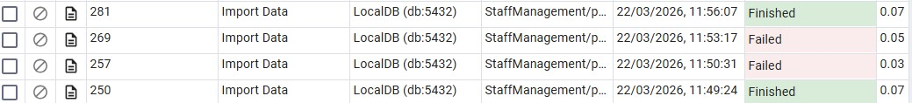

**🏥 Medical Staff Management System - Hospital Database**

**📘 Project Report**
This project is a comprehensive Medical Staff Management System designed to manage the human resources of a hospital, focusing on doctors, nurses, and shift scheduling. It was developed as part of a database course project.

**🧑‍💻 Authors**

*Gitty Schneider (333805950)

*Avital Tal (214939134)

**🏢 Project Scope**

*System: Hospital Management System

*Unit: Medical Staff Management

_______________________________________________________________________________________

**📌 Table of Contents**

1. Overview

2. ERD and DSD Diagrams

3. Data Structure Description

4. Data Insertion Methods

5. Backup & Restore

6. Stage 2 – Advanced SQL Queries & Constraints

    *SELECT Queries
   
    *DELETE Queries
   
    *UPDATE Queries
   
    *Rollback & Commit Transactions
   
    *Constraints Using ALTER TABLE

__________________________________________________________________________________________

**🧾 Overview**

The system is designed to manage the human resource assets of a hospital, specifically focusing on the professional medical team. Key functionalities include:

Shift Scheduling: Managing the many-to-many relationship of staff assignments to shifts.

Role Hierarchy: Organizing data for doctors and nurses while maintaining data integrity.

Department Tracking: Monitoring manpower distribution across various hospital departments.

The system uses foreign keys, specialized roles, and entity relationships to ensure a streamlined workflow for hospital administrators.

Link for the site we made with AI Studio:
file:///Users/gitty/Desktop/SCHOOL/מיניפ%20בסנת/DB_9134_5950/management.html
_____________________________________________________________________________________________

**🗂️ ERD and DSD Diagrams**

ERD (Entity Relationship Diagram)

DSD (Data Structure Diagram)

________________________________________________________________________________________________

**🗃️ Data Structure Description**

Below is a summary of the main entities and their fields:

Staff (Base Entity)
Represents all medical personnel.

Staff_ID (Primary Key)

FirstName

LastName

Role (Doctor/Nurse)

Nurses
Nurse_ID (Foreign Key to Staff)

Certification_Level

Department_ID

Shifts
Shift_ID (Primary Key)

Shift_Date

Shift_Type (Morning/Evening/Night)

_____________________________________________________________________________________________

**📥 Data Insertion Methods**

**Method A: Mockaroo Data Generation**

Data was generated using the Mockaroo website.

We defined schemas that match the database tables and generated sample data.

The generated output was exported as SQL files.

These SQL scripts were executed in pgAdmin to insert data into the database.

**Method B: CSV Import using pgAdmin**

Some of the generated data was exported as CSV files and imported into PostgreSQL using pgAdmin.

During the import process, several issues were encountered:

- Some tables required matching the exact number of columns.
- One of the CSV imports failed due to missing values in a column that did not allow NULL.
- The issue was resolved by adjusting the data and ensuring compatibility with the table structure.

After fixing the issues, the CSV files were successfully imported into the relevant tables.

**Method C: Insert with Python Script**

-- 1. הכנסת 500 מחלקות
INSERT INTO Department (department_id, department_name, location)
SELECT 
    i, 
    'Department ' || i, 
    'Building ' || ((i % 5) + 1) || ', Room ' || i
FROM generate_series(1, 500) AS i;

-- 2. הכנסת 500 עובדים (Staff)
INSERT INTO Staff (staff_id, first_name, last_name, role, phone, email, hire_date, department_id)
SELECT 
    i, 
    'FirstName_' || i, 
    'LastName_' || i, 
    CASE 
        WHEN i <= 200 THEN 'Doctor' 
        WHEN i <= 450 THEN 'Nurse' 
        ELSE 'Admin' 
    END,
    '050-' || LPAD(i::text, 7, '0'),
    'staff' || i || '@hospital.org',
    CURRENT_DATE - (i || ' days')::interval,
    (i % 500) + 1 -- מקשר למחלקות שיצרנו
FROM generate_series(1, 500) AS i;

-- 3. הכנסת רופאים (200 הראשונים מה-Staff הם דוקטורים)
INSERT INTO Doctor (doctor_id, specialization, license_number, staff_id)
SELECT 
    i, 
    CASE WHEN i % 2 = 0 THEN 'Cardiology' ELSE 'Pediatrics' END,
    'LIC-' || i || '-XYZ',
    i
FROM generate_series(1, 200) AS i;

-- 4. הכנסת אחיות (עובדים 201 עד 450)
INSERT INTO Nurse (nurse_id, certification, staff_id)
SELECT 
    i - 200, 
    'Advanced Care Cert ' || i,
    i
FROM generate_series(201, 450) AS i;

-- 5. הכנסת 500 משמרות (Shift)
INSERT INTO Shift (shift_id, shift_name, start_time, end_time)
SELECT 
    i, 
    'Shift ' || i, 
    '08:00:00', 
    '16:00:00'
FROM generate_series(1, 500) AS i;

-- 6. הטבלה הגדולה: 20,000 שיבוצי עובדים (Staff_Shift)
INSERT INTO Staff_Shift (staff_shift_id, shift_date, staff_id, shift_id)
SELECT 
    i, 
    '2024-01-01'::date + (i % 365 || ' days')::interval, -- מפזר על פני שנה
    (i % 500) + 1, -- רץ על 500 העובדים
    (i % 500) + 1  -- רץ על 500 המשמרות
FROM generate_series(1, 20000) AS i;

_____________________________________________________________________________________________

**💾 Backup & Restore**

Backup Process
**Backup Process**

A database backup was created using pgAdmin.

The backup process was initiated from the database interface, and a .backup file was generated.

The backup file is included in the project repository.

Although the backup file appears as a binary file and is not readable as plain text, this is expected behavior for PostgreSQL backup files.

The backup operation demonstrates the ability to export the full database for recovery purposes.

-----------------------------------------------------------------------------------------------------
**📘 Stage 2 – Advanced SQL Queries & Constraints**
-----------------------------------------------------------------------------------------------------

This section includes documentation and screenshots for advanced SQL queries (SELECT, DELETE, UPDATE) and constraint handling as required in Stage 2.

**📊 SELECT Queries**

A total of 8 SELECT queries were implemented. Each query is described and accompanied by screenshots.

🔍 SELECT 1: Monthly Workload Report 

This is for the "Management Dashboard" screen to see how many shifts each staff member did per month.

🔍 SELECT 2: Department Staffing Levels

Find departments that have fewer than 30 Nurses assigned

🔍 SELECT 3: Staff Performance: Low-Volume Responders

Finds staff members who have worked less than 5 shifts in the first quarter of the year.

🔍 SELECT 4: Department Head Oversight Report

Joins 4 tables to show Department names, their Head Doctors, and the total staff in that department.

(The 4 Double Queries- Efficiency Comparison)

🔍 SELECT 5: Active Doctors in Cardiology

Option A (Subquery) Option B (JOIN):

🔍 SELECT 6:Identifying "Multi-Role" Staff

Find staff members who are registered as both a Doctor and a Nurse (Data Integrity check).

Option A (INTERSECT) Option B (JOIN):

🔍 SELECT 7: Staff with Assignments on a Specific Date

Find the emails of staff members working on '2026-03-20'

Option A (EXISTS) Option B (JOIN):

🔍 SELECT 8: Specialization Availability by Department

ist the names and emails of all Doctors who are specialized in 'Pediatrics' and work in Department ID 1

Option A (IN Subquery) Option B (JOIN):

-----------------------------------------------------------------------------------------------------

**📊 DELETE Queries**
🔍 DELETE 1: Removing Old Shift Records

To maintain database efficiency and reduce unnecessary data storage, old shift records that are no longer relevant were removed from the system.

This query:
Deletes shifts older than one year
Keeps only relevant and recent data
SQL Features Used
Date comparison
INTERVAL usage

🔍 DELETE 2: Removing Duplicate Shift Records

During data entry or imports, duplicate shift records may occur.
This query ensures data integrity by removing duplicate records while keeping one valid entry.

This query:
Identifies duplicate rows based on:
staff_id
shift_id
shift_date
Keeps only the earliest record using MIN
Deletes all other duplicates
SQL Features Used
Subquery
GROUP BY
Aggregate function (MIN)

🔍 DELETE 3: Removing Inactive Departments

Over time, some hospital departments may become inactive and no longer have staff assigned to them.
To keep the system clean and accurate, these unused departments were removed.

This query:
Deletes departments that:
Have no staff assigned
Have no recent activity
Uses a safe approach to avoid foreign key violations
SQL Features Used
NOT EXISTS
JOIN
Date filtering with INTERVAL

-----------------------------------------------------------------------------------------------------

**📊 UPDATE Queries**
🔍 UPDATE 1: Assigning a New Head Doctor to the Engineering Department

In the hospital system, an Engineering department required a new head doctor due to administrative changes.
To simulate a realistic management decision, we selected a doctor with the specialization Cardiology and assigned them as the new head of the department.

This query:
Selects a doctor with a specific specialization (Cardiology)
Assigns that doctor as the head of the Engineering department
SQL Features Used
Subquery
LIMIT (to ensure only one doctor is selected)

🔍 UPDATE 2: Modifying Future Shifts

Due to increased workload and operational needs, hospital management decided to adjust future shift assignments.
All upcoming Evening shifts (Shift 2) were reassigned to Night shifts (Shift 3) to ensure better coverage.

This query:
Targets only future shifts
Updates shift type from 2 → 3
Leaves past data unchanged
SQL Features Used
Date filtering using CURRENT_DATE

🔍 UPDATE 3: Balancing Workload for Overloaded Staff

The hospital system identified staff members who were assigned to multiple shifts, potentially causing workload imbalance.
To prevent staff burnout and improve scheduling fairness, their future shifts were reassigned to a lighter shift type.

This query:
Identifies staff with more than 3 shifts using GROUP BY and HAVING
Updates only their future shifts
Reassigns them to Shift 1 (lighter workload)
SQL Features Used
Subquery
GROUP BY + HAVING
Date filtering

-----------------------------------------------------------------------------------------------------

**Rollback & Commit Transactions**

Rollback Demonstration

We simulated a mass email update error and used ROLLBACK to restore data integrity.

 Database state during the transaction (Unsaved Error):
 

 Database state after ROLLBACK (Data Restored):

Commit Demonstration

We successfully updated the hospital wing location and used COMMIT to save the changes permanently.

Previewing the location update:

Final state after COMMIT:

-----------------------------------------------------------------------------------------------------

**Constraints Using ALTER TABLE**

