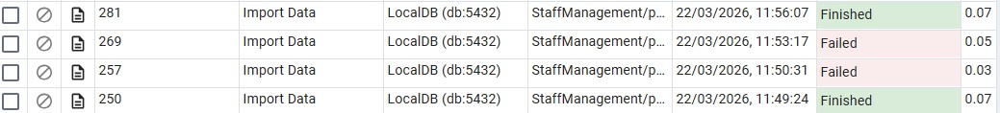
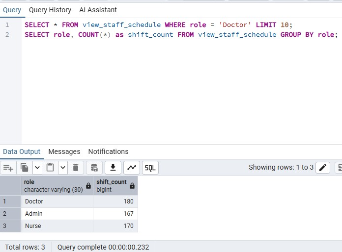
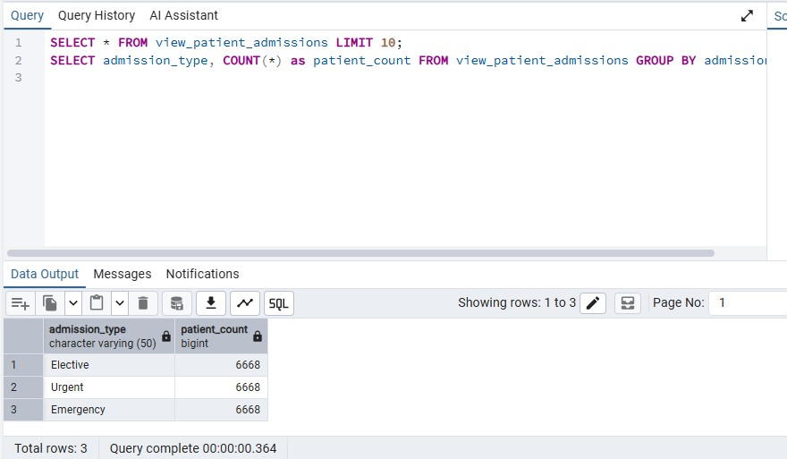
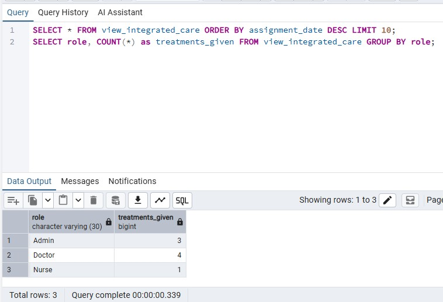
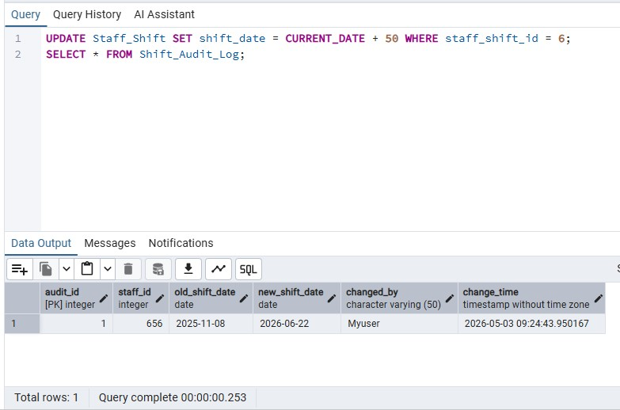
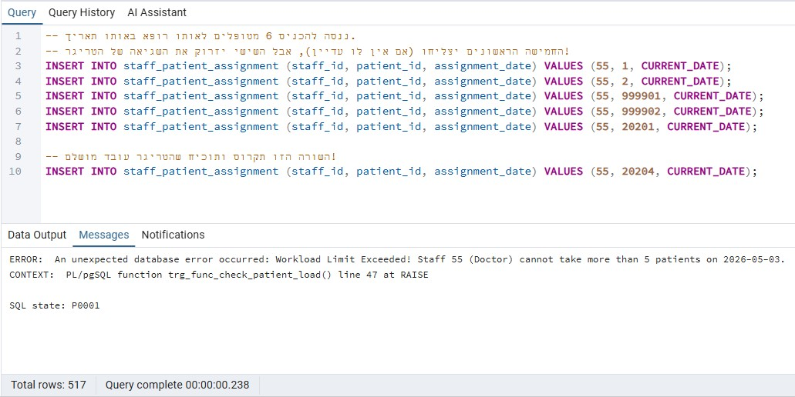
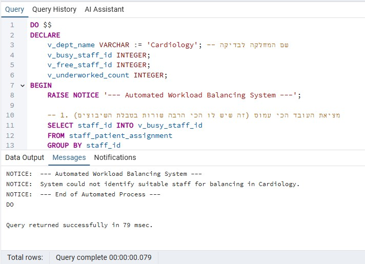
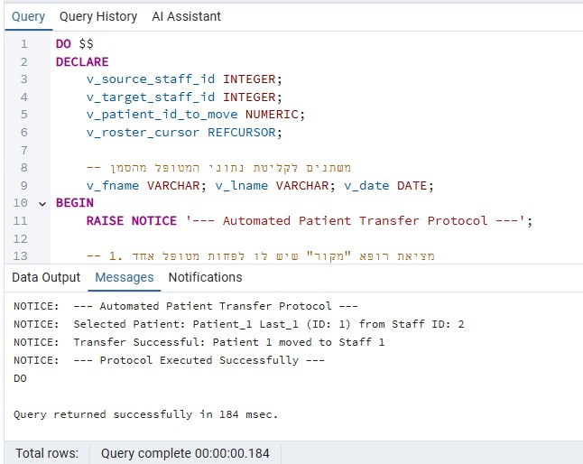

**🏥 Medical Staff Management System - Hospital Database**

**📘 Project Report**
This project is a comprehensive Medical Staff Management System designed to manage the human resources of a hospital, focusing on doctors, nurses, and shift scheduling. It was developed as part of a database course project.

**🧑‍💻 Authors**

*Gitty Schneider (333805950)

*Avital Tal (214939134)

**🏢 Project Scope**

*System: Hospital Management System

*Unit: Medical Staff Management

_______________________________________________________________________________________

**📌 Table of Contents**

1. Overview

2. ERD and DSD Diagrams

3. Data Structure Description

4. Data Insertion Methods

5. Backup & Restore

6. Stage 2 – Advanced SQL Queries & Constraints

    *SELECT Queries
   
    *DELETE Queries
   
    *UPDATE Queries
   
    *Rollback & Commit Transactions
   
    *Constraints Using ALTER TABLE
   
6. Stage 3 – Advanced SQL Queries & Constraints

    *DSD new
   
    *ERD new 

    *Integrated/ combined DSD
   
    *Integrated/ combined ERD
   
    *Integration decisions made
   
    *Explanation of the processes and the commands

7. Stage 4 – Advanced PL/pgSQL Programs
   
    *Functions
   
    *Procedures
   
    *Triggers
   
    *Main Programs


__________________________________________________________________________________________

**🧾 Stage 1- Overview**

The system is designed to manage the human resource assets of a hospital, specifically focusing on the professional medical team. Key functionalities include:

Shift Scheduling: Managing the many-to-many relationship of staff assignments to shifts.

Role Hierarchy: Organizing data for doctors and nurses while maintaining data integrity.

Department Tracking: Monitoring manpower distribution across various hospital departments.

The system uses foreign keys, specialized roles, and entity relationships to ensure a streamlined workflow for hospital administrators.

Link for the site we made with AI Studio:
file:///Users/gitty/Desktop/SCHOOL/מיניפ%20בסנת/DB_9134_5950/management.html
_____________________________________________________________________________________________

**🗂️ ERD and DSD Diagrams**

ERD (Entity Relationship Diagram)


DSD (Data Structure Diagram)


________________________________________________________________________________________________

**🗃️ Data Structure Description**

Below is a summary of the main entities and their fields:

Staff (Base Entity)
Represents all medical personnel.

Staff_ID (Primary Key)

FirstName

LastName

Role (Doctor/Nurse)

Nurses
Nurse_ID (Foreign Key to Staff)

Certification_Level

Department_ID

Shifts
Shift_ID (Primary Key)

Shift_Date

Shift_Type (Morning/Evening/Night)

_____________________________________________________________________________________________

**📥 Data Insertion Methods**

**Method A: Mockaroo Data Generation**

Data was generated using the Mockaroo website.

We defined schemas that match the database tables and generated sample data.

The generated output was exported as SQL files.

These SQL scripts were executed in pgAdmin to insert data into the database.


**Method B: CSV Import using pgAdmin**

Some of the generated data was exported as CSV files and imported into PostgreSQL using pgAdmin.

During the import process, several issues were encountered:

- Some tables required matching the exact number of columns.
- One of the CSV imports failed due to missing values in a column that did not allow NULL.
- The issue was resolved by adjusting the data and ensuring compatibility with the table structure.

After fixing the issues, the CSV files were successfully imported into the relevant tables.



**Method C: Insert with Python Script**

-- 1. הכנסת 500 מחלקות
INSERT INTO Department (department_id, department_name, location)
SELECT 
    i, 
    'Department ' || i, 
    'Building ' || ((i % 5) + 1) || ', Room ' || i
FROM generate_series(1, 500) AS i;

-- 2. הכנסת 500 עובדים (Staff)
INSERT INTO Staff (staff_id, first_name, last_name, role, phone, email, hire_date, department_id)
SELECT 
    i, 
    'FirstName_' || i, 
    'LastName_' || i, 
    CASE 
        WHEN i <= 200 THEN 'Doctor' 
        WHEN i <= 450 THEN 'Nurse' 
        ELSE 'Admin' 
    END,
    '050-' || LPAD(i::text, 7, '0'),
    'staff' || i || '@hospital.org',
    CURRENT_DATE - (i || ' days')::interval,
    (i % 500) + 1 -- מקשר למחלקות שיצרנו
FROM generate_series(1, 500) AS i;

-- 3. הכנסת רופאים (200 הראשונים מה-Staff הם דוקטורים)
INSERT INTO Doctor (doctor_id, specialization, license_number, staff_id)
SELECT 
    i, 
    CASE WHEN i % 2 = 0 THEN 'Cardiology' ELSE 'Pediatrics' END,
    'LIC-' || i || '-XYZ',
    i
FROM generate_series(1, 200) AS i;

-- 4. הכנסת אחיות (עובדים 201 עד 450)
INSERT INTO Nurse (nurse_id, certification, staff_id)
SELECT 
    i - 200, 
    'Advanced Care Cert ' || i,
    i
FROM generate_series(201, 450) AS i;

-- 5. הכנסת 500 משמרות (Shift)
INSERT INTO Shift (shift_id, shift_name, start_time, end_time)
SELECT 
    i, 
    'Shift ' || i, 
    '08:00:00', 
    '16:00:00'
FROM generate_series(1, 500) AS i;

-- 6. הטבלה הגדולה: 20,000 שיבוצי עובדים (Staff_Shift)
INSERT INTO Staff_Shift (staff_shift_id, shift_date, staff_id, shift_id)
SELECT 
    i, 
    '2024-01-01'::date + (i % 365 || ' days')::interval, -- מפזר על פני שנה
    (i % 500) + 1, -- רץ על 500 העובדים
    (i % 500) + 1  -- רץ על 500 המשמרות
FROM generate_series(1, 20000) AS i;


_____________________________________________________________________________________________

**💾 Backup & Restore**

Backup Process
**Backup Process**

A database backup was created using pgAdmin.

The backup process was initiated from the database interface, and a .backup file was generated.

The backup file is included in the project repository.

Although the backup file appears as a binary file and is not readable as plain text, this is expected behavior for PostgreSQL backup files.

The backup operation demonstrates the ability to export the full database for recovery purposes.


-----------------------------------------------------------------------------------------------------
**📘 Stage 2 – Advanced SQL Queries & Constraints**
-----------------------------------------------------------------------------------------------------

This section includes documentation and screenshots for advanced SQL queries (SELECT, DELETE, UPDATE) and constraint handling as required in Stage 2.

**📊 SELECT Queries**

A total of 8 SELECT queries were implemented. Each query is described and accompanied by screenshots.

🔍 SELECT 1: Monthly Workload Report 

This is for the "Management Dashboard" screen to see how many shifts each staff member did per month.


🔍 SELECT 2: Department Staffing Levels

Find departments that have fewer than 30 Nurses assigned


🔍 SELECT 3: Staff Performance: Low-Volume Responders

Finds staff members who have worked less than 5 shifts in the first quarter of the year.


🔍 SELECT 4: Department Head Oversight Report

Joins 3 tables to show Department names, their Head Doctors, and the total staff in that department.


(The 4 Double Queries- Efficiency Comparison)

🔍 SELECT 5: Active Doctors in Cardiology

Option A (Subquery) Option B (JOIN):


🔍 SELECT 6:Identifying "Multi-Role" Staff

Find staff members who are registered as both a Doctor and a Nurse (Data Integrity check).

Option A (INTERSECT) Option B (JOIN):


🔍 SELECT 7: Staff with Assignments on a Specific Date

Find the emails of staff members working on '2026-03-20'

Option A (EXISTS) Option B (JOIN):


🔍 SELECT 8: Specialization Availability by Department

ist the names and emails of all Doctors who are specialized in 'Pediatrics' and work in Department ID 1

Option A (IN Subquery) Option B (JOIN):


-----------------------------------------------------------------------------------------------------

**📊 DELETE Queries**
🔍 DELETE 1: Removing Old Shift Records

To maintain database efficiency and reduce unnecessary data storage, old shift records that are no longer relevant were removed from the system.

This query:
Deletes shifts older than one year
Keeps only relevant and recent data
SQL Features Used
Date comparison
INTERVAL usage


🔍 DELETE 2: Removing Duplicate Shift Records

During data entry or imports, duplicate shift records may occur.
This query ensures data integrity by removing duplicate records while keeping one valid entry.

This query:
Identifies duplicate rows based on:
staff_id
shift_id
shift_date
Keeps only the earliest record using MIN
Deletes all other duplicates
SQL Features Used
Subquery
GROUP BY
Aggregate function (MIN)


🔍 DELETE 3: Removing Inactive Departments

Over time, some hospital departments may become inactive and no longer have staff assigned to them.
To keep the system clean and accurate, these unused departments were removed.

This query:
Deletes departments that:
Have no staff assigned
Have no recent activity
Uses a safe approach to avoid foreign key violations
SQL Features Used
NOT EXISTS
JOIN
Date filtering with INTERVAL


-----------------------------------------------------------------------------------------------------

**📊 UPDATE Queries**
🔍 UPDATE 1: Assigning a New Head Doctor to the Engineering Department

In the hospital system, an Engineering department required a new head doctor due to administrative changes.
To simulate a realistic management decision, we selected a doctor with the specialization Cardiology and assigned them as the new head of the department.

This query:
Selects a doctor with a specific specialization (Cardiology)
Assigns that doctor as the head of the Engineering department
SQL Features Used
Subquery
LIMIT (to ensure only one doctor is selected)


🔍 UPDATE 2: Modifying Future Shifts

Due to increased workload and operational needs, hospital management decided to adjust future shift assignments.
All upcoming Evening shifts (Shift 2) were reassigned to Night shifts (Shift 3) to ensure better coverage.

This query:
Targets only future shifts
Updates shift type from 2 → 3
Leaves past data unchanged
SQL Features Used
Date filtering using CURRENT_DATE


🔍 UPDATE 3: Balancing Workload for Overloaded Staff

The hospital system identified staff members who were assigned to multiple shifts, potentially causing workload imbalance.
To prevent staff burnout and improve scheduling fairness, their future shifts were reassigned to a lighter shift type.

This query:
Identifies staff with more than 3 shifts using GROUP BY and HAVING
Updates only their future shifts
Reassigns them to Shift 1 (lighter workload)
SQL Features Used
Subquery
GROUP BY + HAVING
Date filtering


-----------------------------------------------------------------------------------------------------

**Rollback & Commit Transactions**

Rollback Demonstration

We simulated a mass email update error and used ROLLBACK to restore data integrity.

 Database state during the transaction (Unsaved Error):
 


 Database state after ROLLBACK (Data Restored):


Commit Demonstration

We successfully updated the hospital wing location and used COMMIT to save the changes permanently.

Previewing the location update:


Final state after COMMIT:


-----------------------------------------------------------------------------------------------------

**Constraints Using ALTER TABLE**


-----------------------------------------------------------------------------------------------------
**📘 Stage 3 – Integration and Views**
-----------------------------------------------------------------------------------------------------

📜This stage focuses on integrating the Financial Department database with the Dormitory Management database — a crucial component of the overall university management system. The objective is to build a unified structure that enables a comprehensive view of student-related information, combining both financial and residential data. As part of this integration, SQL views were created from both the perspective of our department and the collaborating department. These views provide streamlined, role-specific access to the combined data, making it easier for each side to retrieve and analyze the information most relevant to their operational needs.

-----------------------------------------------------------------------------------------------------

**🗂️ DSD new**


-----------------------------------------------------------------------------------------------------

**🗂️ ERD new**


-----------------------------------------------------------------------------------------------------

**🗂️ Integrated/ combined DSD**


-----------------------------------------------------------------------------------------------------

**🗂️ Integrated/ combined ERD**


-----------------------------------------------------------------------------------------------------

**🏗️ Integration decisions made**

1. The Core Strategy: Option B (Foreign Tables)

We chose to implement the integration using Option B, which utilizes Foreign Data Wrappers (FDW).

The Decision: Instead of migrating all data into a single schema (Option C), we kept the two databases independent.

The Logic: This mimics a real-world hospital scenario where different departments (Staff HR vs. Clinical Patient Care) might use different software systems but need to share specific data for daily operations. It ensures data remains "owned" by the original department.

2. The Integration Point (The Bridge)

The Decision: We identified the Staff table (our system) and the Patient table (the external system) as the primary points of connection.

The Logic: A Many-to-Many (M:N) relationship was established. In a clinical setting, one doctor or nurse treats many patients, and one patient can be treated by multiple staff members (specialists, residents, etc.).

The Process: We created a local bridge table, staff_patient_assignment, which stores the IDs from both systems to link them without altering the original table structures.

-----------------------------------------------------------------------------------------------------

**💻 Explanation of the processes and the commands**


The integration was performed in three technical phases:

Phase 1: Establishing the Connection

We used the postgres_fdw extension to create a bridge between the local "Medical Staff" database and the remote "Patient" database.

CREATE EXTENSION postgres_fdw: Installs the library that allows PostgreSQL to talk to other PostgreSQL servers.

CREATE SERVER: Defines the location and name of the partner's database.

CREATE USER MAPPING: Provides the credentials needed to securely access the partner's data.

Phase 2: Virtualizing the External Data

We created Foreign Tables to act as "windows" into the other group's database.

CREATE FOREIGN TABLE: This command does not copy data; it creates a local definition of the remote table. This allowed us to query patient_remote as if it were a local table, even though the data lives elsewhere.

Phase 3: Creating Meaningful Views

To prove the integration was successful, we wrote complex Views that perform JOIN operations across the local and foreign tables.

The Process: We used a 4-way JOIN connecting Staff → staff_patient_assignment → patient_remote → admission_remote.

The Result: This provides a unified "Doctor-Patient Roster" that shows real-time hospital activity, fulfilling the project requirements for non-trivial queries.

### 📊 Views & Queries Implementation

To prove the success of our integration and ensure high performance, we designed three distinct views.

#### 🔹 VIEW 1: Local Wing (Staff Schedule)
**Description:** This view queries our local `Medical Staff` database to show the upcoming shifts for all staff members, combining data from the `Staff`, `Staff_Shift`, and `Shift` tables.
**Executed Queries:**
1. Retrieve the next upcoming shifts specifically for Doctors.
2. Analytical query showing the total number of shifts scheduled per staff role.



-----------------------------------------------------------------------------------------------------

#### 🔹 VIEW 2: Partner Wing (Remote Patient Admissions)
**Description:** This view successfully queries the remote `Patient` database (using our `partner_schema` FDW) to display patients and their current admission types, proving connectivity without physical data migration.
**Executed Queries:**
1. Retrieve a sample list of patients and their current admission types from the foreign tables.
2. Analytical query analyzing the remote data to count the number of patients per admission type.



-----------------------------------------------------------------------------------------------------

#### 🔹 VIEW 3: Cross-Database Integration (The Bridge)
**Description:** The core of our Option B integration. It joins the local `Staff` table with the remote `Patient` and `Admission` tables using our `staff_patient_assignment` bridge table, providing a real-time "Doctor-Patient Roster".
**Executed Queries:**
1. The Integrated Roster: Shows exactly which local staff member is currently treating which remote patient.
2. Workload Analysis: An analytical query showing how many patient interactions each staff role has handled across the integrated system.



-----------------------------------------------------------------------------------------------------
**Stage 4 – Advanced PL/pgSQL Programs**
-----------------------------------------------------------------------------------------------------

**Functions**

**Function 1**

This function serves as a strategic management tool for decision-making within the medical wing. It enables department heads to identify the "under-utilization" of human resources by calculating the number of staff members who have completed a low volume of shifts—specifically those at or below a defined threshold (in this case, one shift or fewer).


Proof of running:


**Function 2**

This function acts as a clinical reporting tool that generates a dynamic roster of patients assigned to a specific medical staff member. It is specifically designed to work with the Integrated Wing (Step C), bridging the local Staff database with the remote Patient database using the Staff_Patient_Assignment table.


Proof of running:


-----------------------------------------------------------------------------------------------------

**Procedures**

**Procedure 1**

This procedure handles moving a patient from one doctor/staff member to another.


Proof of running:


**Procedure 2**

This procedure is highly professional because it uses Transfers to prevent burnout. It moves a specific number of patients from a busy staff member to a less busy one.


Proof of running:


---
### Triggers

**Trigger 1: Data Integrity & Audit Guard**
This trigger functions as an automated compliance and auditing mechanism for staff scheduling. It operates on the `Staff_Shift` table to prevent administrative errors, actively blocking any attempts to reschedule shifts to past dates (preserving historical accuracy). Furthermore, it implements a DML tracking system that automatically logs all valid schedule modifications into a dedicated `Shift_Audit_Log` table, ensuring complete traceability of administrative actions.
```sql
-------------------------------------------------------------------------------------------------------------
Trigger 1: Prevent past shifts and log audit
---------------------------------------------------------------------------------------------------------------

-- 1. Creating the trigger function
CREATE OR REPLACE FUNCTION trg_func_validate_shift_update()
RETURNS TRIGGER AS $$
DECLARE
    v_role VARCHAR(50);
BEGIN
    -- Implicit Cursor: Retrieving the employee role to verify that it exists
    SELECT role INTO STRICT v_role 
    FROM Staff 
    WHERE staff_id = NEW.staff_id;

    -- Branching: Checking if an attempt is made to change a shift date to the past
    IF NEW.shift_date < CURRENT_DATE THEN
        --Throwing an error will stop the UPDATE
        RAISE EXCEPTION 'Invalid Operation: Cannot move shift for a [%] (Staff ID: %) to a past date (%).', 
                        v_role, NEW.staff_id, NEW.shift_date;
    END IF;

    -- DML: Recording the change in the audit table (only if the date has actually changed)
    IF OLD.shift_date IS DISTINCT FROM NEW.shift_date THEN
        INSERT INTO Shift_Audit_Log (staff_id, old_shift_date, new_shift_date, changed_by)
        VALUES (NEW.staff_id, OLD.shift_date, NEW.shift_date, CURRENT_USER);
    END IF;

    RETURN NEW; --Confirm the update
    
EXCEPTIoN
    -- Exception Handling: What happens if the employee is deleted or does not exist?
    WHEN NO_DATA_FOUND THEN
        RAISE EXCEPTION 'Security Alert: Staff ID % does not exist in the system.', NEW.staff_id;
END;
$$ LANGUAGE plpgsql;

-- 2. Linking the trigger to the table
DROP TRIGGER IF EXISTS trg_update_shift ON Staff_Shift;

CREATE TRIGGER trg_update_shift
BEFORE UPDATE ON Staff_Shift
FOR EACH ROW
EXECUTE FUNCTION trg_func_validate_shift_update();
```

**Proof of running:**




**Trigger 2: Clinical Workload Management**
Designed specifically for our integrated cross-database system (Step C), this trigger acts as a safety guardrail to prevent medical staff burnout and ensure quality patient care. Before assigning a new remote patient to a local staff member in the `staff_patient_assignment` bridge table, it dynamically calculates the staff member's current daily workload. It enforces strict, role-specific clinical capacities (e.g., maximum 5 patients for Doctors, 8 for Nurses) and automatically blocks any assignments that exceed this safety threshold.
```sql
-------------------------------------------------------------------------------------------------------------
Trigger 2: Check patient load capacity
---------------------------------------------------------------------------------------------------------------

-- 1. Creating the Trigger Function
CREATE OR REPLACE FUNCTION trg_func_check_patient_load()
RETURNS TRIGGER AS $$
DECLARE
    v_staff_role VARCHAR(50);
    v_patient_count INT := 0;
    v_max_patients INT;
    v_assignment_rec RECORD; -- Using a Record Variable
    
    -- Explicit cursor
    c_today_assignments CURSOR FOR
        SELECT assignment_id 
        FROM staff_patient_assignment
        WHERE staff_id = NEW.staff_id AND assignment_date = NEW.assignment_date;
BEGIN
    -- Finding the staff role
    SELECT role INTO STRICT v_staff_role FROM Staff WHERE staff_id = NEW.staff_id;

    -- Branching: Determining Maximum Load by Role
    IF v_staff_role = 'Doctor' THEN
        v_max_patients := 5;
    ELSIF v_staff_role = 'Nurse' THEN
        v_max_patients := 8;
    ELSE
        v_max_patients := 3; -- For Managers and Other Staff
    END IF;

    -- A Loop That Runs on the Explicit Cursor to Count Patients
    OPEN c_today_assignments;
    LOOP
        FETCH c_today_assignments INTO v_assignment_rec;
        EXIT WHEN NOT FOUND;
        v_patient_count := v_patient_count + 1;
    END LOOP;
    CLOSE c_today_assignments;

    -- Throwing an Exception if the Worker is Too Busy
    IF v_patient_count >= v_max_patients THEN
        RAISE EXCEPTION 'Workload Limit Exceeded! Staff % (%) cannot take more than % patients on %.', 
            NEW.staff_id, v_staff_role, v_max_patients, NEW.assignment_date;
    END IF;

    RETURN NEW; -- Approval to perform the insertion into the table

EXCEPTION
    WHEN NO_DATA_FOUND THEN
        RAISE EXCEPTION 'Assignment failed: Invalid Staff ID provided.';
    WHEN OTHERS THEN
        RAISE EXCEPTION 'An unexpected database error occurred: %', SQLERRM;
END;
$$ LANGUAGE plpgsql;

-- 2. Linking the trigger to the linking table
DROP TRIGGER IF EXISTS trg_insert_assignment ON staff_patient_assignment;

CREATE TRIGGER trg_insert_assignment
BEFORE INSERT OR UPDATE ON staff_patient_assignment
FOR EACH ROW
EXECUTE FUNCTION trg_func_check_patient_load();
```

**Proof of running:**



---
### Main Programs (Execution Blocks)

To demonstrate the full integration and orchestration of our PL/pgSQL components, we developed two main anonymous execution blocks (DO blocks). These programs are highly dynamic, using `SELECT INTO` statements to find relevant data at runtime rather than relying on hardcoded IDs.

**Main Program 1: Automated Workload Balancing System**
This anonymous block acts as an advanced administrative automation script. It dynamically queries the database to identify the most overloaded staff member across the system, and locates an available staff member within a specific department (e.g., Cardiology). It then integrates `Function 1` to verify under-utilization and calls `Procedure 2` to automatically transfer a batch of patients, effectively balancing the hospital's workload in real-time.
```sql
-------------------------------------------------------------------------------------------------------------
Main Program 1: Automated Workload Balancing System
---------------------------------------------------------------------------------------------------------------

DO $$ 
DECLARE
    v_dept_name VARCHAR := 'Cardiology'; -- The department name to check
    v_busy_staff_id INTEGER;
    v_free_staff_id INTEGER;
    v_underworked_count INTEGER;
BEGIN
    RAISE NOTICE '--- Automated Workload Balancing System ---';

    -- 1. Finding the busiest employee (the one with the most rows in the assignment table)
    SELECT staff_id INTO v_busy_staff_id 
    FROM staff_patient_assignment 
    GROUP BY staff_id 
    ORDER BY COUNT(*) DESC 
    LIMIT 1;

    -- 2. Finding a staff member from the desired department (perform JOIN to filter by department name)
    SELECT s.staff_id INTO v_free_staff_id 
    FROM Staff s
    JOIN Department d ON s.department_id = d.department_id
    WHERE d.department_name = v_dept_name
    LIMIT 1;

    -- 3. Checking how many "underworked" staff members are in the department (using the partner's function)
    v_underworked_count := get_underworked_staff_count(v_dept_name);

    -- Decision logic
    IF v_busy_staff_id IS NOT NULL AND v_free_staff_id IS NOT NULL AND v_underworked_count > 0 THEN
        RAISE NOTICE 'Found Busy Staff (ID: %) and Available Staff (ID: %) in %.', 
                     v_busy_staff_id, v_free_staff_id, v_dept_name;
        
        -- Calling the balancing procedure (transferring 2 patients)
        CALL balance_emergency_overflow(v_busy_staff_id, v_free_staff_id, 2);
    ELSE
        RAISE NOTICE 'System could not identify suitable staff for balancing in %.', v_dept_name;
    END IF;

    RAISE NOTICE '--- End of Automated Process ---';
END; 
$$;
```

**Proof of running:**



**Main Program 2: Automated Patient Transfer Protocol**
This program automates specific clinical handoffs. It dynamically identifies a staff member currently treating patients and an available target staff member. Using `Function 2`, it retrieves a dynamic roster (RefCursor) of the source staff's patients, fetches the first assigned patient from the cursor, and immediately executes `Procedure 1` to safely transfer that specific patient to the new medical staff member.
```sql
-------------------------------------------------------------------------------------------------------------
Main Program 2: Automated Patient Transfer Protocol
---------------------------------------------------------------------------------------------------------------

DO $$ 
DECLARE
    v_source_staff_id INTEGER;
    v_target_staff_id INTEGER;
    v_patient_id_to_move NUMERIC;
    v_roster_cursor REFCURSOR;
    
    -- Variables for receiving patient data from the marker
    v_fname VARCHAR; v_lname VARCHAR; v_date DATE;
BEGIN
    RAISE NOTICE '--- Automated Patient Transfer Protocol ---';

    -- 1.Finding a "source" doctor who has at least one patient
    SELECT staff_id INTO v_source_staff_id 
    FROM staff_patient_assignment 
    LIMIT 1;

    -- 2.Finding a "target" doctor that is different from the source doctor
    SELECT staff_id INTO v_target_staff_id 
    FROM Staff 
    WHERE staff_id <> v_source_staff_id 
    LIMIT 1;

    IF v_source_staff_id IS NOT NULL AND v_target_staff_id IS NOT NULL THEN
        -- 3. Using a function to get the cursor of the patient list
        v_roster_cursor := get_staff_patient_roster(v_source_staff_id);
        
        -- 4. Retrieving the first patient from the cursor to get their ID
-- (The cursor returns names, so we will retrieve the ID directly from the table for this patient)
        SELECT patient_id INTO v_patient_id_to_move 
        FROM staff_patient_assignment 
        WHERE staff_id = v_source_staff_id 
        LIMIT 1;

        FETCH v_roster_cursor INTO v_fname, v_lname, v_date;

        IF FOUND THEN
            RAISE NOTICE 'Selected Patient: % % (ID: %) from Staff ID: %', 
                         v_fname, v_lname, v_patient_id_to_move, v_source_staff_id;
            
            -- 5.Performing the transfer to the destination doctor
            CALL transfer_patient_assignment(v_source_staff_id, v_target_staff_id, v_patient_id_to_move);
        END IF;
        
        CLOSE v_roster_cursor;
    ELSE
        RAISE NOTICE 'Insufficient data found to perform transfer.';
    END IF;

    RAISE NOTICE '--- Protocol Executed Successfully ---';
END; 
$$;
```

**Proof of running:**




---

# Stage 5 – Graphical User Interface

GUI application for the Hospital Medical Staff Management System.

---

## 📋 Prerequisites

- Python 3.8 or higher
- PostgreSQL running with the database from Stages 1–4
- `psycopg2-binary` package

## 🚀 Setup & Run

### 1. Install dependencies

```bash
pip install psycopg2-binary
```

### 2. Configure the database connection

Open **`db.py`** and update the `DB_CONFIG` dictionary with your credentials:

```python
DB_CONFIG = {
    "host": "localhost",
    "port": 5432,
    "database": "hospital_db",   # your DB name
    "user": "postgres",          # your username
    "password": "your_password"  # your password
}
```

### 3. Configure the function/procedure names (if needed)

Open **`screens/procedures_screen.py`** and verify the names match your Stage 4 code:

- Line ~95: `"get_underutilized_staff_count"` — change to your function's actual name
- Line ~160: `"transfer_patient"` — change to your procedure's actual name

### 4. Run the application

```bash
python main.py
```

---

## 🗂️ Project Structure

```
stage5/
├── main.py                  # Entry point - login/menu screen
├── db.py                    # Database connection layer
├── styles.py                # Colors, fonts, spacing constants
├── widgets.py               # Reusable styled widgets
├── README.md                # This file
└── screens/
    ├── __init__.py
    ├── crud_base.py         # Generic CRUD screen (the base class)
    ├── staff_screen.py      # Staff / Doctor / Nurse tabs
    ├── department_screen.py # Department CRUD
    ├── shift_screen.py      # Shift / Staff_Shift tabs
    ├── queries_screen.py    # Runs Stage 2 SELECT queries
    └── procedures_screen.py # Runs Stage 4 functions/procedures
```

## 🎯 Features

### Screens
- **Main Menu** – central navigation with connection status indicator
- **Staff Management** – CRUD for Staff, Doctors, and Nurses (3 tabs)
- **Departments** – CRUD for departments
- **Shifts & Assignments** – CRUD for Shifts and Staff_Shift (2 tabs)
- **Reports & Queries** – runs 2 of the Stage 2 SELECT queries:
  - Monthly Workload Report
  - Understaffed Departments
- **Procedures & Functions** – runs 2 of the Stage 4 PL/pgSQL programs:
  - Function: `get_underutilized_staff_count`
  - Procedure: `transfer_patient`

### CRUD operations (on every table screen)
- **Insert** – fill the form, click Insert
- **Update** – enter the primary key, click "Load Record" to fetch existing data, edit, click Update
- **Delete** – enter the primary key, click Delete (with confirmation)
- **Read** – data table on the right refreshes automatically; click any row to load it into the form

### UX details (per Stage 5 requirements)
- **No raw IDs are shown** — foreign keys are displayed as the related entity's name (e.g. "Cardiology" instead of department_id = 5)
- **FK dropdowns** — when selecting a department, role, etc., users pick from a dropdown of names
- **Update workflow** — user enters the PK and the system fetches the rest, just like the spec requires

---

## 🛠️ How the code is organized (for the report)

The codebase uses a **generic CRUD base class** (`crud_base.py`) that handles all the shared logic for table screens. Each table-specific screen then just declares its configuration:

```python
class DepartmentScreen(CRUDScreen):
    TABLE = "department"
    TITLE = "Department Management"
    PRIMARY_KEY = "department_id"
    FIELDS = [...]
    DISPLAY_QUERY = "SELECT ... ORDER BY ..."
```

This means:
- The same proven CRUD logic is reused across all 7+ tables (less bugs)
- Adding a new table is fast — just write the configuration
- Foreign keys are declared declaratively: `{"type": "fk", "fk_table": "department", "fk_display": "department_name"}` automatically becomes a dropdown showing names

## 🧰 Tools used

- **Python 3** – language
- **Tkinter / ttk** – GUI framework (standard library, no external GUI deps)
- **psycopg2** – PostgreSQL driver
- **PostgreSQL** – database (from Stages 1–4)

## 🐛 Troubleshooting

**"Database error" on the home screen**
- Check that PostgreSQL is running
- Verify the credentials in `db.py`
- Verify your database name matches

**"Function does not exist" when clicking a procedure button**
- Open `screens/procedures_screen.py` and update the function/procedure names to match what you actually created in PostgreSQL during Stage 4

**Combobox is empty (FK dropdown has no options)**
- This means the FK table is empty or the column names in `fk_key`/`fk_display` don't match. Check the table actually has rows and the column names are correct.

**Tkinter not installed (Linux)**
```bash
sudo apt-get install python3-tk
```

